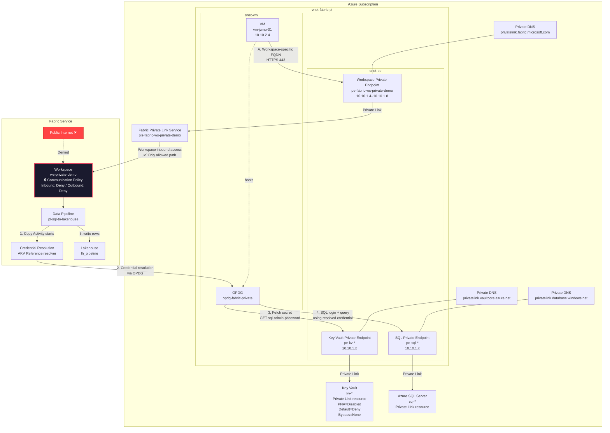

# Fabric Pipeline (OPDG) ─ Azure SQL Database Private Endpoint → Lakehouse 実装手順

## 0. 概要

本ガイドでは、Microsoft Fabric の閉域ネットワーク環境で **Azure SQL Database → Lakehouse** パイプラインを構築する手順を説明します。

### 構成のポイント

- Fabric Workspace は **Communication Policy: Inbound/Outbound = Deny** で閉域化
- SQL 接続のパスワードは **AKV Reference** (Azure Key Vault 参照) で動的に解決
- SQL / Key Vault への通信はすべて **Private Endpoint** 経由
- **On-premises Data Gateway (OPDG)** が VNet 内の VM 上で動作し、Private Endpoint 経由のアクセスを仲介
- Workspace へのアクセスは **Workspace-level Private Link** 経由のみ

> **重要:** OPDG 接続で AKV Reference を使う場合、シークレット解決は OPDG (VM) 経由で行われます。OPDG が VNet 内にあるため Key Vault Private Endpoint を経由してシークレットを取得でき、`Public network access = Disabled` でも動作します。

---

## 1. ネットワーク構成図



### 1.1 通信経路の整理

| 通信 | 経路 | 備考 |
|---|---|---|
| Key Vault シークレット解決 | Fabric → OPDG → Key Vault PE | AKV Reference。**OPDG 経由で PE を使う** |
| SQL 接続 | Fabric → OPDG → SQL Private Endpoint | シークレット解決後に実行 |
| Workspace アクセス | VM → Workspace Private Endpoint → Workspace | Private Link 経由のみ許可 |
| OPDG 制御チャネル | VM 上の OPDG → Fabric サービス | Workspace-level Private Link とは別の通信 |
| Lakehouse 書き込み | Fabric Pipeline → OneLake | Fabric 管理プレーン内の通信 |

### 1.2 Key Vault のネットワーク設定

OPDG 接続で AKV Reference を使う場合、シークレット解決は OPDG 経由で行われます。OPDG (VM) は VNet 内にあり、Key Vault Private Endpoint を経由してシークレットを取得します。

**Private Endpoint 経由のアクセスは Key Vault のファイアウォール設定に一切影響されません** ([公式ドキュメント](https://learn.microsoft.com/azure/key-vault/general/overview-security#the-key-vault-request-operation-flow-with-authentication))。

そのため、Key Vault は完全閉域の設定で運用できます。

```powershell
az keyvault update -g <RESOURCE_GROUP> -n <KEY_VAULT_NAME> `
    --public-network-access Disabled `
    --default-action Deny `
    --bypass None
```

> **補足:** Key Vault ファイアウォールは以下の 4 条件を評価し、いずれか 1 つでも満たせばアクセスを許可します。
> 1. ファイアウォールが無効
> 2. 信頼された Microsoft サービス
> 3. IP / VNet ルールに一致
> 4. **Private Link 接続経由** ← 今回はこれが該当
>
> `publicNetworkAccess=Disabled` は条件 1〜3 を無効化しますが、条件 4 (PE 経由) は常に許可されます。

---

## 2. 前提条件

### 2.1 必要な権限・ツール

| 項目 | 要件 |
|---|---|
| Azure CLI | `az` コマンドが使用可能であること |
| Azure サブスクリプション | Contributor 以上の権限 |
| Fabric テナント | 管理者権限 (テナント設定変更のため) |
| Fabric Capacity | F2 以上の SKU |
| Key Vault | `Key Vault Secrets User` ロール (操作ユーザーに付与) |

### 2.2 構築されるリソース一覧

#### Azure / Network

| 種別 | 名前の例 | 用途 |
|---|---|---|
| Resource Group | `rg-fabric-pl-demo` | 全リソースの格納先 |
| VNet | `vnet-fabric-pl` | 閉域ネットワーク基盤 |
| Subnet | `snet-pe` | Private Endpoint 用 |
| Subnet | `snet-vm` | VM (OPDG ホスト) 用 |
| NAT Gateway | `natgw-vm` | VM のアウトバウンド通信 |
| Key Vault | `kv-*` | SQL 認証情報の格納 |
| Key Vault PE | `pe-kv-*` | Key Vault への Private Endpoint |
| SQL Server | `sql-*` | データソース |
| SQL Database | `salesdb` | テスト用 DB |
| SQL PE | `pe-sql-*` | SQL への Private Endpoint |
| Private DNS | `privatelink.vaultcore.azure.net` | Key Vault PE 用 |
| Private DNS | `privatelink.database.windows.net` | SQL PE 用 |
| Private DNS | `privatelink.fabric.microsoft.com` | Workspace PE 用 |
| VM | `vm-jump-01` | OPDG ホスト / 踏み台 |
| Bastion | `bastion-*` | VM への安全な接続 |

#### Key Vault Secrets

| Secret 名 | 用途 |
|---|---|
| `sql-admin-username` | SQL ログイン名 |
| `sql-admin-password` | SQL パスワード |
| `sql-server-fqdn` | SQL 接続先 FQDN |
| `sql-database-name` | DB 名 |

#### Fabric

| 種別 | 名前の例 | 用途 |
|---|---|---|
| Workspace | `ws-private-demo` | 閉域ワークスペース |
| Lakehouse | `lh_pipeline` | データ格納先 |
| Pipeline | `pl-sql-to-lakehouse` | データコピーパイプライン |
| AKV Reference | `kv-fabric-demo` | Key Vault 参照エイリアス |
| SQL Connection | `conn-sql-opdg` | OPDG 経由の SQL 接続 |

---

## 3. 構築手順

### Phase 1: Azure インフラストラクチャの構築

`scripts/deploy_fabric_private_env.ps1` で VNet / サブネット / Key Vault / PE / VM / Bastion / Workspace Private Link Service を自動構築します。

```powershell
cd scripts
.\deploy_fabric_private_env.ps1 `
    -Location "westus3" `
    -ResourceGroup "rg-fabric-pl-demo"
```

> このスクリプトは冪等に作られており、再実行しても既存リソースはスキップされます。

### Phase 2: Azure SQL Server + Private Endpoint の構築

```powershell
.\setup_azure_sql_pe.ps1 `
    -ResourceGroup "rg-fabric-pl-demo" `
    -Location "westus3" `
    -VNetName "vnet-fabric-pl" `
    -SubnetPe "snet-pe" `
    -VmName "vm-jump-01" `
    -KvName "<KEY_VAULT_NAME>"
```

以下が自動構築されます:
1. Azure SQL Server + Database (`salesdb`)
2. SQL Private Endpoint + DNS Zone Group
3. VM run-command 経由でサンプルテーブル作成・データ投入
4. Key Vault に SQL 認証情報を格納

### Phase 3: OPDG のインストール

VM 上に On-premises Data Gateway をサイレントインストールします。

```powershell
az vm run-command invoke `
    -g <RESOURCE_GROUP> -n <VM_NAME> `
    --command-id RunPowerShellScript `
    --scripts "@scripts/install_opdg_on_vm.ps1" `
    --parameters `
        spAppId=<SERVICE_PRINCIPAL_APP_ID> `
        spSecret=<SERVICE_PRINCIPAL_SECRET> `
        spTenant=<TENANT_ID> `
        recoveryKey=<RECOVERY_KEY>
```

> OPDG 登録にはサービスプリンシパルが必要です。事前に Entra ID でアプリ登録し、Fabric テナント設定で「Allow service principals to use Power BI APIs」を有効にしてください。

### Phase 4: Fabric テナント設定 (手動)

Fabric Admin Portal で以下を有効化します:

1. **Configure workspace-level inbound network rules** — ワークスペース単位の閉域化を許可
2. **Allow service principals to use Power BI APIs** — OPDG 登録に必要

### Phase 5: Fabric 接続の作成 (Fabric ポータル)

#### 5.1 Azure Key Vault 参照

Fabric ポータルの **Manage connections and gateways** で作成:

| 項目 | 値 |
|---|---|
| 参照エイリアス | `kv-fabric-demo` |
| 接続の種類 | `Azure Keyvault Service` |
| Account Name | `<KEY_VAULT_NAME>` |
| 認証方法 | `OAuth 2.0` |
| オンプレミス/VNet GW で利用可能にする | **有効** |

#### 5.2 SQL コネクション

| 項目 | 値 |
|---|---|
| Connection name | `conn-sql-opdg` |
| Connection type | `SQL Server` |
| Gateway cluster name | `<OPDG_NAME>` |
| Server | `<SQL_SERVER_FQDN>` |
| Database | `salesdb` |
| 認証方法 | `基本` |
| Username | `<SQL_ADMIN_USER>` |
| Azure Key Vault の参照 | `kv-fabric-demo` |
| シークレット | `sql-admin-password` |

> **注意:** 接続作成時のテスト接続が失敗する場合でも、保存後に Pipeline 実行は成功するケースがあります。必要に応じて「テスト接続をスキップする」を使用してください。

#### 5.3 操作ユーザーの権限

AKV Reference は OBO (On Behalf Of) で解決されるため、操作ユーザーに Key Vault の参照権限が必要です。

```powershell
$userOid = az ad signed-in-user show --query id -o tsv
$kvId    = az keyvault show -g <RESOURCE_GROUP> -n <KEY_VAULT_NAME> --query id -o tsv

az role assignment create `
    --assignee-object-id $userOid `
    --assignee-principal-type User `
    --role "Key Vault Secrets User" `
    --scope $kvId
```

### Phase 6: Workspace の閉域化

#### 6.1 Workspace-level Private Link の設定

1. Azure で `Microsoft.Fabric/privateLinkServicesForFabric` リソースを作成する
    - ARM テンプレート: [`templates/pls.template.json`](../templates/pls.template.json)
    - `tenantId` と `workspaceId` を自環境に合わせて編集
2. VNet に Workspace 用 Private Endpoint を作成する
    - Resource type: `Microsoft.Fabric/privateLinkServicesForFabric`
    - Target subresource: `workspace`
3. Private DNS `privatelink.fabric.microsoft.com` を VNet にリンクする
4. VM から Workspace FQDN を `nslookup` し、Private IP に解決されることを確認する

#### 6.2 Communication Policy の設定

Fabric portal の **Workspace settings > Inbound networking** で `Allow connections from selected networks and workspace level private links` を選択し適用します。

Workspace FQDN の例:
```text
https://{workspaceid}.z{xy}.w.api.fabric.microsoft.com
https://{workspaceid}.z{xy}.c.fabric.microsoft.com
https://{workspaceid}.z{xy}.onelake.fabric.microsoft.com
```

### Phase 7: Pipeline の作成・実行

```powershell
cd scripts
.\create_sql_pipeline.ps1 -SqlConnId "<conn-sql-opdg の接続 ID>"
```

接続 ID の確認方法:

```powershell
$tok = az account get-access-token `
    --resource https://api.fabric.microsoft.com --query accessToken -o tsv
$h   = @{ Authorization = "Bearer $tok" }

(Invoke-RestMethod "https://api.fabric.microsoft.com/v1/connections" -Headers $h).value |
    Where-Object { $_.displayName -eq "conn-sql-opdg" } |
    Select-Object id, displayName, connectionDetails
```

---

## 4. Pipeline の内容

Pipeline は Copy Activity 1 本で構成されます。

```text
[CopySqlToLakehouse]
  Source: AzureSqlTable dbo.SalesData
  Connection: conn-sql-opdg
  Sink: LakehouseTable lh_pipeline / Tables/SalesData
```

Pipeline 定義テンプレート: [`templates/pipeline_sql_kv_def.json`](../templates/pipeline_sql_kv_def.json)

### 4.1 実行時フロー

1. Copy Activity が開始される
2. Fabric が OPDG にシークレット解決を委任する
3. OPDG (VM) が Key Vault PE 経由で `sql-admin-password` を取得する
4. 解決済みの資格情報を使って、OPDG が SQL PE 経由で DB に接続し `dbo.SalesData` を読む
5. 結果を Lakehouse テーブルへ書き込む

---

## 5. 検証

### 5.1 確認ポイント

- Lakehouse に `SalesData` テーブルが作成される
- テーブルプレビューでデータが確認できる
- SQL パスワードは Key Vault の `sql-admin-password` から動的に解決される

---

## 6. 運用メモ

### 6.1 パスワードローテーション

Key Vault 側で `sql-admin-password` を更新すれば、次回の Pipeline 実行時から新しい値が使われます。SQL コネクションの再作成は不要です。

### 6.2 接続を再作成した場合

SQL コネクションを作り直すと接続 ID が変わります。Pipeline が古い接続 ID を参照したままだと `DMTS_EntityNotFoundOrUnauthorized` で失敗します。

対処:
1. 最新の接続 ID を取得する
2. Pipeline の接続参照を新 ID に差し替える
3. Pipeline を保存して再実行する

---

## 7. よくある失敗

| 現象 | 原因 | 対処 |
|---|---|---|
| `SecretNotFound` | Key Vault PE が未構成、または OPDG の DNS 解決が `privatelink.vaultcore.azure.net` に向いていない | Key Vault PE と Private DNS Zone の VNet リンクを確認 |
| `Login failed for user` | AKV Reference のシークレット名誤り、または SQL パスワード不一致 | Key Vault のシークレット値を確認 |
| `DMTS_EntityNotFoundOrUnauthorized` | Pipeline が古い接続 ID を参照 | 最新の接続 ID に差し替え |
| `Cannot open server` | SQL PE / Private DNS の不整合 | VM 上で DNS 解決と接続性を確認 |

---

## 8. 参照ファイル

| ファイル | 内容 |
|---|---|
| [scripts/deploy_fabric_private_env.ps1](../scripts/deploy_fabric_private_env.ps1) | Azure インフラストラクチャ自動構築 |
| [scripts/setup_azure_sql_pe.ps1](../scripts/setup_azure_sql_pe.ps1) | Azure SQL + PE + DNS + KV secrets 構築 |
| [scripts/install_opdg_on_vm.ps1](../scripts/install_opdg_on_vm.ps1) | VM 上の OPDG サイレントインストール |
| [scripts/create_sql_pipeline.ps1](../scripts/create_sql_pipeline.ps1) | Pipeline デプロイ・実行スクリプト |
| [templates/pipeline_sql_kv_def.json](../templates/pipeline_sql_kv_def.json) | Pipeline 定義テンプレート |
| [templates/pls.template.json](../templates/pls.template.json) | Fabric Private Link Service ARM テンプレート |
