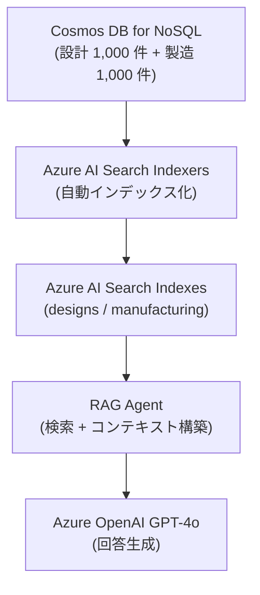
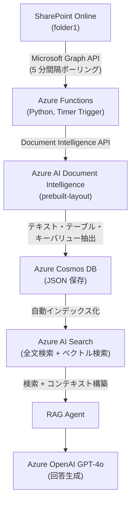
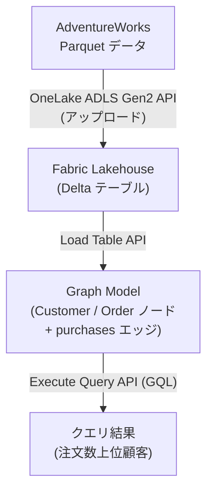

# DemoPublic

Azure と AI を活用した半導体製造データ分析のデモプロジェクト集です。私が手元で検証した内容を紹介いたします。

## プロジェクト一覧

| プロジェクト | 概要 | 主要技術 |
|-------------|------|---------|
| [CosmosDBNoSQLAIAgentPublic](./CosmosDBNoSQLAIAgentPublic/) | Cosmos DB + AI Search による半導体 KPI データ分析 AI エージェント | .NET 8.0, Bicep, C# |
| [SemiDocAI4SPS](./SemiDocAI4SPS/) | SharePoint Online ドキュメントの自動テキスト化 + RAG 質問応答システム | Python, Azure Functions |
| [FabricGraph](./FabricGraph/) | Microsoft Fabric Graph model で AdventureWorks データのグラフ分析 | Python, PowerShell, GQL |

---

## CosmosDBNoSQLAIAgentPublic

Azure Cosmos DB for NoSQL と Azure OpenAI を統合した **半導体設計・製造データ分析システム** です。RAG (Retrieval-Augmented Generation) パターンを 2 つのアプローチで実装しています。

### アーキテクチャ

### 2 つの AI エージェントパターン

| パターン | フォルダ | 特徴 |
|---------|---------|------|
| **直接クエリ型** | `src/ai-agent-sql/` | GPT-4o が自然言語から Cosmos DB SQL クエリを自動生成。低レイテンシー、構造化データに最適 |
| **RAG 型** | `AISearchEvaluationAgent/` | Azure AI Search でセマンティック検索。大規模データ・柔軟な検索に対応 |

### 主要コンポーネント

- **Azure Cosmos DB for NoSQL** — 設計部門・製造部門の KPI データ (各 20 列 × 1,000 件)
- **Azure AI Search** — Cosmos DB データのインデックス化・セマンティック検索
- **Azure OpenAI (GPT-4o)** — 大量コンテキストでの自然言語分析
- **Infrastructure as Code** — Bicep による完全自動デプロイ
- **セキュア認証** — Azure AD + RBAC + Managed Identity

👉 詳細は [CosmosDBNoSQLAIAgentPublic/README.md](./CosmosDBNoSQLAIAgentPublic/README.md) を参照

---

## SemiDocAI4SPS

SharePoint Online にアップロードされた半導体関連ドキュメントを **Azure AI Document Intelligence** で自動テキスト化し、**Azure AI Search + Azure OpenAI GPT-4o** による RAG パターンで自然言語の質問応答を実現するサーバーレスシステムです。

### アーキテクチャ

### 対応ファイル形式

PDF / Word (.docx) / Excel (.xlsx) / PowerPoint (.pptx) / 画像 (PNG, JPG, BMP, TIFF)

### 主要コンポーネント

- **Azure Functions (Python)** — SharePoint 監視 + Document Intelligence 連携のサーバーレス処理
- **Azure AI Document Intelligence** — OCR・テーブル・キーバリュー抽出
- **Azure Cosmos DB** — OCR 結果と処理済みファイル追跡の NoSQL ストレージ
- **Azure AI Search** — ベクトル検索 (HNSW + text-embedding-ada-002) + セマンティック構成
- **Azure OpenAI (GPT-4o)** — RAG による質問応答
- **Copilot Studio 連携** — AI Search インデックスをナレッジソースとして直接接続可能

### 認証方式

| 対象 | 認証方式 |
|------|---------|
| SharePoint Online (Graph API) | Azure AD App Registration (Client Credentials) |
| Document Intelligence / Cosmos DB / OpenAI | Managed Identity (DefaultAzureCredential) |
| AI Search → Cosmos DB | Managed Identity (System Assigned) |

👉 詳細は [SemiDocAI4SPS/README.md](./SemiDocAI4SPS/README.md) を参照

---

## FabricGraph

Microsoft Fabric の **Graph model (preview)** を使用して、AdventureWorks サンプルデータからグラフを作成し、**GQL (Graph Query Language)** クエリを REST API 経由で実行するプロジェクトです。UI を使わずプロジェクトをデプロイしています。

### アーキテクチャ

### 主要コンポーネント

- **Microsoft Fabric Graph model** — Lakehouse テーブルからグラフ構造を定義
- **OneLake** — ADLS Gen2 互換のデータレイク
- **Fabric REST API** — ワークスペース・Lakehouse・Graph Model のプログラマティック操作
- **GQL** — ISO 標準ベースの Graph Query Language

👉 詳細は [FabricGraph/README.md](./FabricGraph/README.md) を参照

---

## 共通の技術スタック

- **Azure Cosmos DB for NoSQL** — データストア
- **Azure AI Search** — セマンティック検索 + ベクトル検索
- **Azure OpenAI (GPT-4o)** — 自然言語分析・回答生成
- **Microsoft Fabric** — データレイク + Graph model
- **Managed Identity** — サービス間のキーレス認証
- **RBAC** — ロールベースアクセス制御
